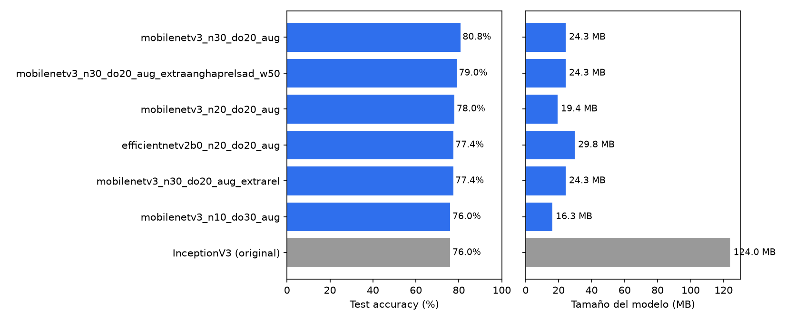
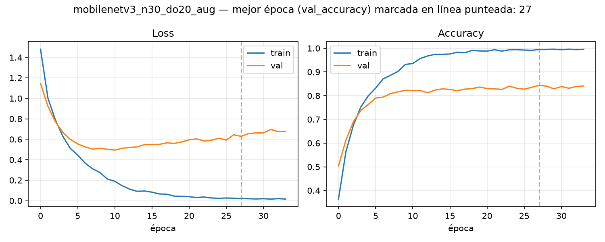
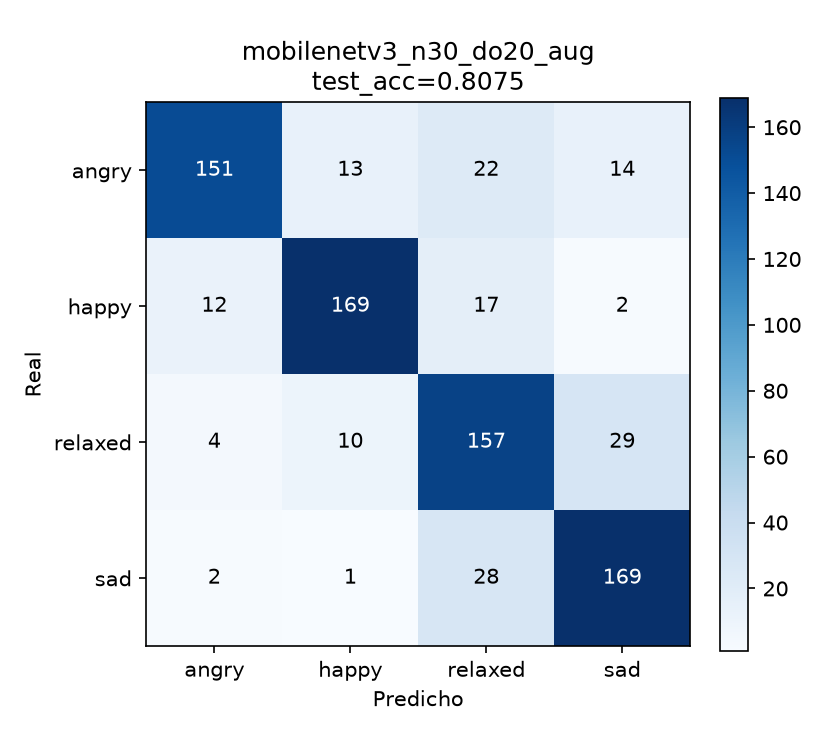

# Informe de resultados — Dog Emotion Web

Estado del modelo al 2026-08-09. Este documento resume qué se probó, qué ganó y
por qué, para tener un punto de referencia claro antes de seguir iterando
(sumar más datos, afinar hiperparámetros, etc.).

## Contexto

Este proyecto parte de un trabajo práctico de *Introducción a la Inteligencia
Artificial* (UNR) — [gaspigz/TP-FINAL-IIA](https://github.com/gaspigz/TP-FINAL-IIA) —
que entrenó InceptionV3 para clasificar 4 emociones caninas (`angry`, `happy`,
`relaxed`, `sad`), llegando a **76,0% de test accuracy** con un modelo de
**124 MB**, usado en una app de escritorio.

El objetivo de esta segunda etapa fue reentrenar con arquitecturas más livianas
para poder correr el modelo en un navegador (TensorFlow.js + GitHub Pages) en vez
de una app local, apuntando a tres cosas: mejor accuracy, un modelo bastante más
chico, y que la inferencia corra del lado del cliente.

## Metodología

Para que los números sean comparables 1 a 1 contra el trabajo original:

- **Mismo dataset**: [Dog Emotion (Kaggle)](https://www.kaggle.com/datasets/danielshanbalico/dog-emotion),
  4000 imágenes, 4 clases balanceadas (1000 c/u).
- **Mismo split**: 60% train / 20% val / 20% test, estratificado, `random_state=42`.
- **Mismo criterio de evaluación**: test accuracy sobre el 20% que nunca participa
  del entrenamiento.

Lo que cambió fue la arquitectura y el pipeline de entrenamiento
(`training/train_lightweight.py`, independiente del notebook original):
MobileNetV3Large y EfficientNetV2B0 en vez de InceptionV3, entrada de 224×224 en
vez de 299×299, y sin necesidad de normalizar a mano ([-1,1]) porque estos
backbones ya traen el rescaling incluido.

Se probaron 4 configuraciones, variando cuántas capas del backbone se
descongelan para fine-tuning y cuánto dropout se aplica antes de la capa final:

| Corrida | Backbone | Capas descongeladas | Dropout | Augmentation |
| --- | --- | --- | --- | --- |
| mobilenetv3_n10_do30_aug | MobileNetV3Large | 10 | 0.3 | sí |
| mobilenetv3_n20_do20_aug | MobileNetV3Large | 20 | 0.2 | sí |
| mobilenetv3_n30_do20_aug | MobileNetV3Large | 30 | 0.2 | sí |
| efficientnetv2b0_n20_do20_aug | EfficientNetV2B0 | 20 | 0.2 | sí |

## Resultados



| Corrida | Test accuracy | Tamaño | Test loss |
| --- | --- | --- | --- |
| **mobilenetv3_n30_do20_aug** (elegido) | **80,75%** | **24,3 MB** | 0,796 |
| mobilenetv3_n20_do20_aug | 78,00% | 19,4 MB | 0,748 |
| efficientnetv2b0_n20_do20_aug | 77,38% | 29,8 MB | 0,588 |
| mobilenetv3_n10_do30_aug | 76,00% | 16,3 MB | 0,631 |
| InceptionV3 (original) | 76,00% | 124,0 MB | — |

**Ganó `mobilenetv3_n30_do20_aug`**: mejor accuracy de las cuatro corridas, y
sigue siendo ~5x más chico que el modelo original. Un detalle no tan intuitivo:
descongelar *más* capas (30 en vez de 20) dio mejor resultado, no peor — la
corrida con menos capacidad y más dropout (`n10_do30`) fue la que peor
generalizó, a pesar de estar pensada para reducir sobreajuste. Con este dataset,
la arquitectura pedía más capacidad, no menos.

Una vez convertido a TensorFlow.js para la web, el modelo final pesa
**3,1 MB** — descarga y corre entero en el navegador, sin backend.

## Análisis del modelo elegido

### Curvas de entrenamiento



El modelo empieza a sobreajustar visiblemente después de la época ~27 (la loss
de validación empieza a subir mientras la de entrenamiento sigue bajando), pero
`EarlyStopping` con `restore_best_weights=True` se queda con los pesos de esa
época, no con los de la última.

### Matriz de confusión (test set, 800 imágenes)



| Clase | Precision | Recall | F1 |
| --- | --- | --- | --- |
| angry | 0,893 | 0,755 | 0,818 |
| happy | 0,876 | 0,845 | 0,860 |
| relaxed | 0,701 | 0,785 | 0,741 |
| sad | 0,790 | 0,845 | 0,816 |

Comparado contra el modelo original, mejoró en **las cuatro clases**, no solo en
el promedio:

| Clase | F1 InceptionV3 (original) | F1 MobileNetV3Large (nuevo) |
| --- | --- | --- |
| angry | 0,799 | 0,818 |
| happy | 0,745 | 0,860 |
| relaxed | 0,702 | 0,741 |
| sad | 0,797 | 0,816 |

Dos patrones se repiten en ambos modelos, arquitecturas totalmente distintas de
por medio — lo que sugiere que son limitaciones del *dataset*, no de la red:

- **`relaxed` sigue siendo la clase más difícil** (F1 más bajo en los dos
  modelos), aunque mejoró un poco (0,702 → 0,741). Mirando la matriz de
  confusión, se confunde casi exclusivamente con `sad` en ambas direcciones
  (29 `relaxed`→`sad`, 28 `sad`→`relaxed`) — tiene sentido: un perro relajado y
  uno triste comparten un lenguaje corporal parecido (poca actividad, sin
  expresiones marcadas), a diferencia de `angry`/`happy` que tienen señales más
  visibles (dientes, orejas, cola).
- **`angry` tiene precision más alta que recall** en los dos modelos (0,893 vs
  0,755 acá; 0,875 vs 0,735 en el original) — el modelo es conservador con esta
  clase: cuando dice `angry` casi siempre acierta, pero se le escapan bastantes
  perros enojados que clasifica como otra cosa.

## Despliegue

- Modelo en TensorFlow.js: [`docs/model/`](docs/model/) (3,1 MB).
- Página (cámara + inferencia en el navegador): [`docs/index.html`](docs/index.html).
- GitHub Pages: pendiente de activar en la configuración del repo (`Settings → Pages`,
  branch `main`, carpeta `/docs` — ver [README](README.md#página-web)).

## Filtro de "¿hay un perro?"

El clasificador de emociones siempre devuelve una de las 4 clases, incluso
apuntando a algo que no es un perro (una persona, un gato, la pared). Se agregó
un filtro liviano antes de clasificar la emoción, usando `MobileNetV3Small`
pre-entrenado en ImageNet **sin fine-tuning**: en el set de 1000 clases
estándar de ImageNet, los índices 151 a 268 son las 118 razas de perro, y
sumar su probabilidad combinada da una señal confiable de "esto es un perro"
sin entrenar nada nuevo. Calibrado contra fotos reales del dataset (dan
0,72–0,95 de probabilidad combinada) y ruido aleatorio (~0,03–0,04), con umbral
en 0,3. Agrega 2,6 MB a la página (`docs/model_gate/`) y corre igual en
`app.py` y en el navegador.

## Experimento: sumar datos extra filtrados (no se adoptó)

`data/images/` tiene ~15.900 imágenes de Flickr sin curar, recolectadas aparte
del dataset de Kaggle. En vez de revisarlas a mano, se usó el modelo elegido
como filtro automático (`training/filter_extra_images.py`): se quedó solo con
las imágenes donde la carpeta de origen y la predicción del modelo coinciden
con confianza ≥ 0,8. Sobrevivió el **40%** (6.374 de 15.921) — señal de que el
dataset es efectivamente ruidoso, como se sospechaba. Por clase: `angry` fue la
que menos sobrevivió (23,2%), `relaxed` la que más (46,4%, 2.016 imágenes).

Se sumaron esas 2.016 imágenes de `relaxed` al entrenamiento (solo a train, con
`sample_weight` para pesar menos que el dataset curado) sobre la misma
configuración ganadora (MobileNetV3Large, 30 capas, dropout 0.2), probando dos
pesos distintos:

| Peso extra | Épocas | test_acc | Recall relaxed | Recall sad |
| --- | --- | --- | --- | --- |
| — (sin extra) | 34 | **80,75%** | 0,785 | 0,845 |
| 0,5 | 22 | 77,88% | **0,880** | 0,695 |
| 0,2 | 12 | 77,38% | 0,775 | 0,770 |

Ninguno de los dos pesos superó al modelo sin datos extra — **no se adoptó**,
el modelo en producción sigue siendo `mobilenetv3_n30_do20_aug`.

Con peso 0,5 se ve un patrón claro: el recall de `relaxed` mejoró de verdad
(reconoce más perros relajados reales), pero a costa de "gatillo fácil" —
empezó a etiquetar como `relaxed` una porción mucho mayor de fotos de `sad`
(58 casos contra 28 antes), justo la clase con la que más se confunde. Con
peso 0,2 se esperaba un punto intermedio entre el baseline y el de peso 0,5,
pero dio *peor* que ambos y paró mucho antes (época 12 contra 22 y 34) — no
alcanzó a moverle la aguja a `relaxed` pero sí metió ruido suficiente para
perjudicar un poco a todas las clases por igual. Esa falta de patrón limpio
entre 0,2 y 0,5 sugiere que buena parte de la diferencia es simplemente
varianza entre corridas (con menos épocas, hay menos margen para que el
entrenamiento se asiente), no solo el peso en sí.

### Tercer intento: otro dataset de Kaggle, sumando a las 4 clases parejo

Se encontró otro dataset ("Final dog dataset", en `archive/`) con 3876
imágenes. Antes de usarlo se cruzaron los nombres de archivo contra lo que ya
había: **2336 son las mismas del dataset de Kaggle original y 1514 las mismas
de `data/images/`** — es decir, casi no aporta imágenes realmente nuevas, es
en gran parte una recombinación de las mismas dos fuentes. Más importante
todavía: **468 de esas imágenes resultaron ser parte del test set** que se
viene usando para comparar todas las corridas de este informe — se excluyeron
antes de entrenar nada (`training/build_archive_manifest.py`) para no
contaminar la comparación.

Lo que sí aporta este dataset es una curación *distinta* de la carpeta de
Flickr: en vez de concentrarse en una sola clase (como el filtro propio, que
solo tomó `relaxed`), viene parejo entre las 4 (753–979 imágenes por clase
después de sacar el solapamiento con test). Se probó sumar las 3408 imágenes
utilizables a las 4 clases a la vez (peso 0,5):

| Intento | test_acc | Recall relaxed | Recall sad |
| --- | --- | --- | --- |
| Sin extra | **80,75%** | 0,785 | 0,845 |
| Extra "relaxed" solo, peso 0,5 | 77,88% | 0,880 | 0,695 |
| Extra "relaxed" solo, peso 0,2 | 77,38% | 0,775 | 0,770 |
| Extra 4 clases parejo, peso 0,5 | 79,00% | 0,835 | 0,750 |

Sumar a las 4 clases parejo dio el mejor resultado de los tres intentos con
datos extra (79,00%, contra 77,88% y 77,38%) — confirma que concentrar el
refuerzo en una sola clase distorsiona más de lo que ayuda. Pero **tampoco
superó a no sumar nada** (80,75%), y el mismo patrón de fondo se repite: sube
el recall de `relaxed` a costa de confundir más `sad` con `relaxed` (43 casos
contra 28 del baseline — menos grave que los 58 del primer intento, pero
sigue ahí).

Que **los tres intentos, con dos fuentes de datos distintas y tres
configuraciones distintas, choquen contra el mismo límite** (mejorar
`relaxed` cuesta `sad`) es la señal más fuerte hasta ahora de que el problema
no es cuánta data se suma ni cómo se pesa, sino que el modelo ve algo
genuinamente ambiguo entre esas dos clases en las imágenes mismas — exactamente
lo que ya había notado el informe del trabajo original. No se siguió
iterando sobre pesos/combinaciones para no extender la búsqueda
indefinidamente sin una señal de que vaya a funcionar; el modelo en producción
sigue siendo `mobilenetv3_n30_do20_aug` (80,75%, sin datos extra).

## Limitaciones y próximos pasos

- Con tres intentos de sumar datos chocando contra el mismo límite
  (`relaxed` vs `sad`), revisar a mano una muestra de ambas clases (las de
  Kaggle y las que pasaron los filtros de Flickr) pesa más que seguir
  probando combinaciones de pesos — si el problema es de etiquetas dudosas o
  ambigüedad visual real, ningún ajuste de datos ni de hiperparámetros lo va
  a resolver solo.
- No se hizo un barrido más fino alrededor de `n_capas=30` (por ejemplo 25 o 35)
  para confirmar si ese es realmente el óptimo o si se puede exprimir un poco más.

## Reproducibilidad

Los tres gráficos de este informe se generan con:

```bash
python training/generate_report_assets.py --model models/mobilenetv3_n30_do20_aug.keras
```

Vuelve a bajar el dataset, reconstruye el mismo split de test, y corre el modelo
elegido sobre esas 800 imágenes para recalcular la matriz de confusión desde cero
(no son números pegados a mano).
